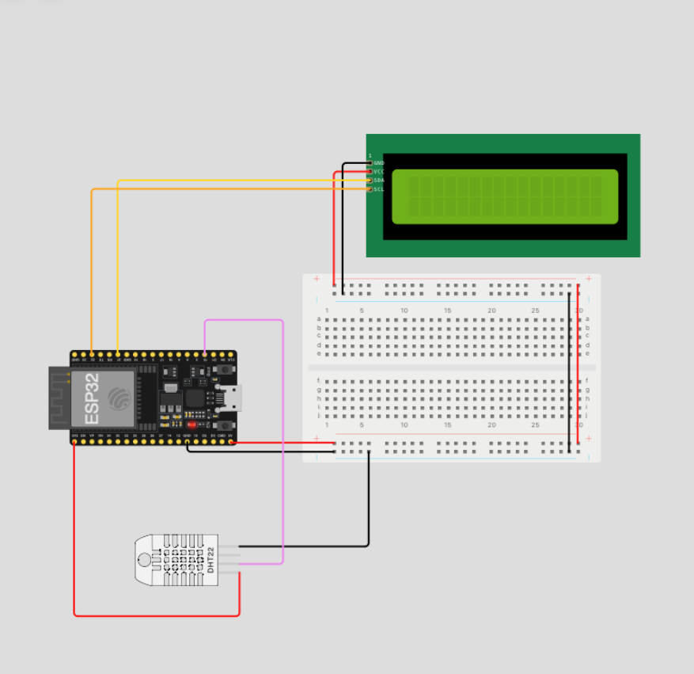

# Edge Computing | Global Solution 

# Objetivo
O objetivo desta tarefa é o desenvolvimento de uma arquitetura para uma aplicação loT capaz de receber e transmitir dados provenientes de dispositivos conectados.

# Resumo do projeto
Nosso projeto, <b>"ID Médico"</b>, tem como objetivo o desenvolvimento de um software para aplicação mobile, onde o usuário consegue cadastrar todo seu histórico médico relevante (incluindo exames) e compartilhar essas informações com o profissional de saúde da sua escolha, no momento de uma consulta. Isso facilitaria muito a passagem da ficha médica de um paciente para um novo profissional, agilizando a consulta e melhorando o atendimento.

# Solução proposta para Edge Computing
Por nosso projeto se tratar de um software, não fizemos uma simulação diretamente relacionada ao projeto. Porém, para demonstrar os conceitos aprendidos, adaptamos da seguinte forma: 


# Instruções de uso 

- Vídeo explicativo: 
- Simulação: https://wokwi.com/projects/381660760030939137

- Para que o sistema funcione, é necessário montar o circuito com o ESP32, DTH22 e display, conforme o diagrama abaixo. Em seguida, carregue o código correspondente em sua memória.
- Para que o código funcione corretamente, é necessário instalar e declarar as seguintes bibliotecas no início do código:

```c
#include <LiquidCrystal_I2C.h>
#include <Wire.h>
#include "ArduinoJson.h"
#include "EspMQTTClient.h"
#include "DHTesp.h"
```

# Grupo
- André Lambert (RM99148)
- Vitor Maia (RM99658)

# Diagrama do circuito

